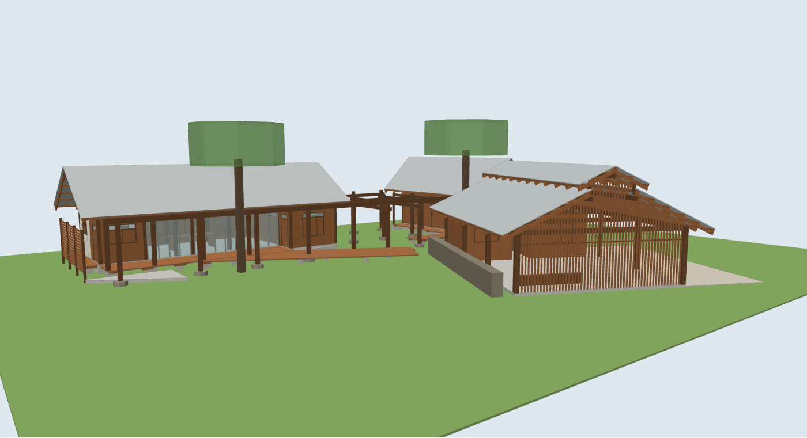
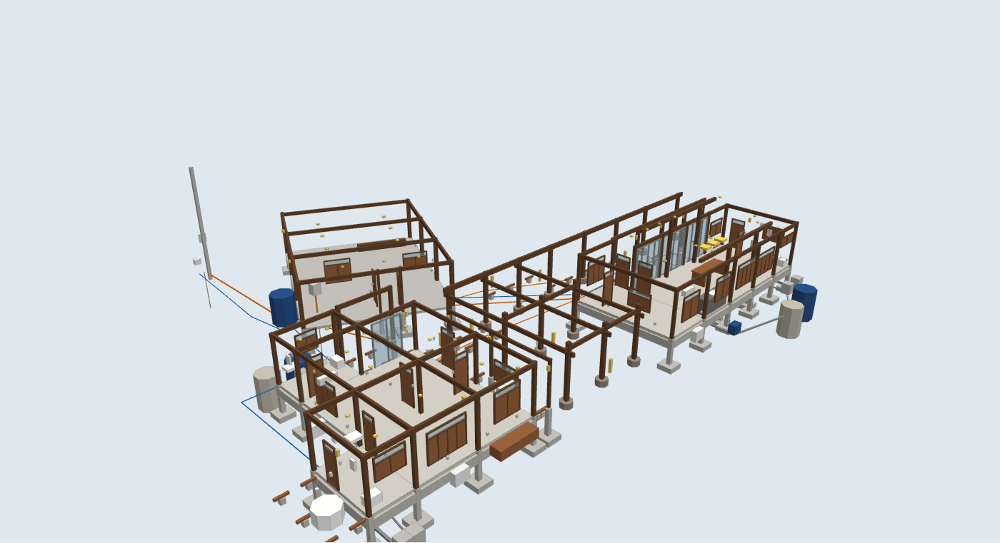

# Baan Sao Yong Hin BIM (บ้านเสายงหิน)

A single-storey compound of reclaimed-timber buildings with corrugated-sheet gable roofs. It was modelled
from `BAAN_SAO_YONG_HIN.rar` (21 images). The archive has a site plan with a 10 m scale bar, the
reclaimed door (D01–D20) and window (W01–W12) schedules, a door and window axonometric, and photos.



| File | What it is |
|---|---|
| `make_model.py` | Parametric source: every dimension lives here. Edit it, then run `python3 make_model.py` |
| `BaanSaoYongHin_BIM.rb` | SketchUp Ruby script (generated): `load` it, then `BaanSaoYongHinBIM.build` |
| `model.js` + `preview.html` | Browser 3D preview (generated data, three.js from `../../web/house-bim-studio/vendor`) |
| `boq.py` | Take-off from the model → BOQ → CPM plan → S-curve → payments |
| `design_calc.py`, `design_report.py` | Preliminary design from the model (foundations, timber superstructure, electrical load) → `design/design_results.json` + `design/design_report.pdf` (Thai, 15 pages) |
| `drawings.py` | 2D drawing set → `design/BaanSaoYongHin_Drawings.pdf` (A3, 6 sheets, Thai title blocks) |
| `run_all.py` | Rebuild everything in order: model → design → model (twice, sizes settle) → BOQ → report → drawings |
| `BaanSaoYongHin_BOQ_Plan.xlsx` | สรุป (ปร.5), BOQ (ปร.4, formulas), ถอดปริมาณ (every quantity traced to a BIM element), ประตูหน้าต่าง, แผนงาน (CPM + Gantt), S-Curve, งวดงาน, ข้อสมมติ |
| `tracker/` | Construction tracker web app (`index.html` + generated `plan.js`); see below |
| `door_window_schedule.csv` | The 32 reclaimed marks (40 physical units) with sizes, pieces available, placed, spare, and where each is used |
| `preview_*.png` | Screenshots of the preview (SW, iso, plan) |
| `reference/` | The source sheets used: scaled site plan, door/window schedules, door/window axonometric |

## What is in the model (450 elements)

| Building | Contents |
|---|---|
| **A** – living pavilion 12.3 × 4.4 m (+ bedroom wing to 5.8 m) | Living/dining, bedroom + wardrobe, bathroom. 30° gable roof (ridge E–W) with 7.5 m span over a 1.8 m south veranda deck. Aluminium bi-fold glass front, reclaimed windows on the north side, white rendered east wall, west slat screen |
| **C** – bedroom house 8.0 × 9.2 m | 2 bedrooms, 2 bathrooms. Twin parallel gables: a tall west one (45°) running out over the entrance porch, and a wide east one (30°). Covered side walk, outdoor-tub deck |
| **D** – garage 7.9 × 10.4 m, turned 26° | 2 store rooms + corridor. Gable roof with a raised clerestory (monitor) roof, vertical slat screen to full gable height, 1.0 m gabion wall |
| **Site** | Timber pergola frames on boulder footings, diagonal deck from A towards D, walkway to C, concrete terrace, 2 existing trees |
| **Plumbing (P-)** | Water meter, HDPE main, 2,000 L tank + booster pump at the garage, PPR cold/hot pipes, 3 WC / 3 basins / 3 showers, pantry sink, outdoor tub, floor drains, PVC soil/waste pipes, 6 inspection chambers, grease trap, 3 septic tanks 1,600 L + 3 soak pits |
| **Electrical (E-)** | PEA pole + 3-phase meter, MDB in store room 2, consumer units in A and C, buried NYY feeders in HDPE, 61 light points (pendants, downlights, wall/post lamps, battens, floods, bollards), 33 sockets, 19 switches, 3 water heaters, 3 split ACs, 4 ground rods |
| **Ceilings** | Woven-bamboo sloped ceiling in A (photo 23), timber T&G ceilings in C and the garage rooms (hidden in the preview; tag `A-Ceiling`) |

Each element is an IFC 2x3 classified group (IfcWall, IfcDoor, IfcWindow, IfcColumn, IfcBeam, IfcMember,
IfcRoof, IfcSlab, IfcFooting, IfcPipeSegment, IfcLightFixture, IfcOutlet, …) with a tag (`S-*`, `A-*`, `P-*`, `E-*`, `Site`) and attributes
(`BSY_BIM` dictionary: mark, size, section, schedule reference, notes).



The MEP layout, cable sizes and pipe sizes are a sketch for estimating. A licensed MEP / electrical engineer
must design them (EIT standards) before construction.

## BOQ and plan (`boq.py`)

| | |
|---|---|
| Direct cost | 2,979,605 baht (structure 1.18 M, architecture 1.24 M, plumbing 0.23 M, electrical 0.32 M) |
| × Factor F 1.2846 | **3,827,601 baht** ≈ 19,444 baht/m² of building slab (196.85 m², decks extra) |
| Plan | 36 activities, 98 working days (Mon–Sat, listed public holidays off), 2 Nov 2026 → 1 Mar 2027 |
| Payments | 8 milestone payments, each valued at the cost of the activities it closes |

Every BOQ row comes from the model: volumes, areas, lengths and counts per building, listed element by
element in the `ถอดปริมาณ` sheet. Unit prices are 2026 estimates (same basis as the TYPE03 template in House
BIM Studio) and are blue input cells in the `BOQ` sheet; the summary, plan costs, S-curve and payments are
formulas, so changing a price updates everything (1,133 formulas, recalculated with no errors). Factor F and the
start date are assumptions, marked yellow. Changing geometry or the start date: edit `make_model.py` / `boq.py`
and run `python3 run_all.py`.

## Preliminary design (`design_calc.py` → `design/design_report.pdf`)

Calculations read the model directly (post positions, roof and wall geometry, fixture and outlet positions,
cable routes) and write the results back into the model and BOQ.

**Foundations** (ACI 318-19 SI, EIT practice; f'c 240 ksc, SD40 / SR24):

- Column loads by tributary area: roof sheets, rafters and purlins, ceilings, walls, doors/windows and timber
  beams are weighed from the model and given to the nearest supporting post. Loads are small (D + Lr ≤ 34 kN).
- All 52 pad footings (incl. 3 garage centre posts): **F1 0.70 × 0.70 × 0.25 m, 4-DB12 @0.18 each way with 90° hooks**, base at −1.20 m
  (bearing ≤ 92 kPa, punching, one-way shear, flexure and hook development all checked).
- RC stumps 0.20 × 0.20 with 4-DB12 and RB9 @0.15; grade beams 0.20 × 0.40 with 3-DB12 top and bottom and RB6 @0.15.
- Wind uplift (V50 25 m/s, open garage CgCp −2.0) is resisted by footing + soil weight on every post; post-to-stump
  connection: 2 steel side plates + 2 M12 through-bolts. Deck piers on 0.40 × 0.40 pads.
- Rebar now comes from the design instead of kg/m³ ratios.

**Timber superstructure** (allowable stress design, reclaimed hardwood at 80 % of new-hardwood stresses):

- Roofs A and C get a **king-post truss (ขื่อ-ดั้ง-ตะเกียบ) on every post line**, so ridge beams span ≤ 4.1 m;
  the garage gets **centre posts under the tie beams** (as in photo Rungkit07) and the clerestory posts stand on the ties.
- The script picks the smallest passing section per member group and writes it back into the model:
  purlins 50×75 @0.80, rafters 50×125 @1.0, ridge/head beams 100×200, ties 100×250 (pair), king posts 100×100,
  struts 50×100, knee braces 50×100 (garage, veranda, side walk, pergola).
- Checked: bending, shear, deflection L/240, uplift reversal (0.6D − W), plates on posts, posts (EIT column formula,
  wind bending on knee-braced frames), knee-brace force and bolts, wall racking (2 let-in diagonal braces per wall
  line), rafter hold-down straps.

**Electrical** (EIT wiring standard approach):

- Connected load 24.3 kVA, demand 24.5 kVA, 36 A per phase after balancing → meter 15(45)A 3-phase, main 3P 40A.
- Building C's board changes to 3-phase (its two 4.5 kW water heaters would put > 60 A on one phase).
- Main NYY 4×16, feeder A NYY 2×10 + G 10, feeder C NYY 4×10 + G 4; all branch circuits 2.5 mm² minimum,
  water heaters 6 mm² on 32 A RCBO; worst total voltage drop 3.1 % (limit 5 %).

**Not covered yet / to be confirmed:** no soil data (qa = 100 kPa is assumed: a soil test must confirm it);
the species, moisture and strength of the reclaimed timber must be confirmed (tests) before using these sizes; cable ampacities and
grounding sizes must be checked against the current EIT tables and the meter size confirmed with PEA. A licensed
civil and electrical engineer must check and sign before construction.

## Drawings (`drawings.py` → `design/BaanSaoYongHin_Drawings.pdf`)

Vector A3 sheets drawn from the model coordinates and the design results, with Thai title blocks, a
"preliminary - not for construction" stamp and empty signature boxes for the architect and engineers:

| Sheet | Content |
|---|---|
| S-01 | Foundation plan 1:125: footings, stumps, grade beams, deck piers, pergola boulders, key dimensions |
| S-02 | Details: footing F1 plan + section 1:20, stump, grade beam section 1:10, post-to-stump connection, footing schedule |
| S-03 | Roof framing sections (A, C-W 1:50; D, C-E 1:75) with ties, king posts, struts, knee braces + timber member schedule |
| E-01 | Single line diagram: PEA → meter → MDB → feeders → CU-A / CU-C, every breaker, RCD and cable |
| E-02 | Load schedules for MDB, CU-A, CU-C with per-phase VA and currents |
| E-03 | Electrical layout 1:125: lights (with circuit numbers), sockets, switches, boards, buried feeder routes |

## Construction tracker (`tracker/index.html`)

One page for the site team: progress per activity, Gantt with % done and actual dates, planned-vs-actual S-curve,
SPI and forecast finish, a 4D model coloured by status (done / in progress / late / not started) with a time
slider and play button (plan mode runs to the planned finish; actual mode runs to the report date and uses the
recorded actual start/finish dates), daily site reports, issues and defects, payment milestones and BOQ value earned.

- On claude.ai (published artifact) the data is shared between everyone who opens it (`db`: `progress`, `logs`,
  `issues`, `payments`, `history`).
- Opened as a local file it keeps the data in that browser only. The 3D view needs three.js from the CDN, or the
  copy in `../../../web/house-bim-studio/vendor/` when offline.
- `screenshot_*_sample.png` show it with made-up sample progress, for illustration only.


## How sure each number is

- **Plan positions and sizes: measured.** They come from the plan with its 10 m scale bar (24.6 px/m; the
  pickup in the garage checks out at about 5.3 m). They are accurate to about ±0.2 m.
- **Door and window sizes: real.** They are taken from the reclaimed-unit schedule sheets. Where each unit
  sits is estimated from the plan, the axonometric and the photos. The sheets list 32 marks but 40 physical units:
  W03, W04 and W11 have 3 pieces each and W05, W06 have 2 ("3 PIECES" on the sheet is read as 3 units available).
  30 units are installed in the model and 10 are spare: doors D01, D04, D05, D06, D09, D10, D11 and one each of
  W03, W04 and W11. (By mark: 25 of the 32 marks are used at least once.)
- **Heights and roof pitches: estimated** from photos. Floor +0.45, wall plate +3.10 (A) / +2.95 (C) /
  +2.70 (D), pitches 30° / 45° / 25°.
- **Foundations: preliminary design** (see above), based on an assumed bearing capacity.
- **Timber superstructure: preliminary design** (see above), on assumed allowable stresses for reclaimed hardwood.
- `Gemini_Generated_Image_*.png` in the archive shows a different flat-roof house, so it is not modelled.

## Commands in SketchUp (Ruby Console)

```ruby
load 'C:/path/BaanSaoYongHin_BIM.rb'
BaanSaoYongHinBIM.build            # build everything (IFC 2x3 classified groups + tags + scenes)
BaanSaoYongHinBIM.report           # quantities + door/window schedule
BaanSaoYongHinBIM.export_csv('C:/temp/bsy')
BaanSaoYongHinBIM.clashes          # bounding-box clash check
```

The clash check compares axis-aligned bounding boxes. The garage is turned 26°, so its walls, posts and
screens show up as false clash pairs. Wall-end × post pairs at corners are by design.

To get IFC, use SketchUp Pro: File → Export → IFC.
